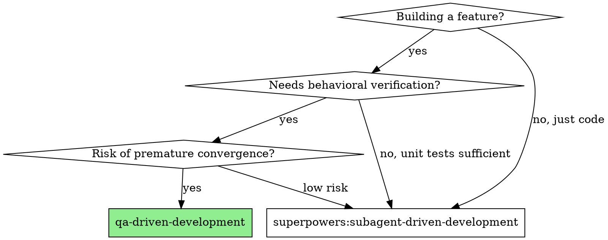
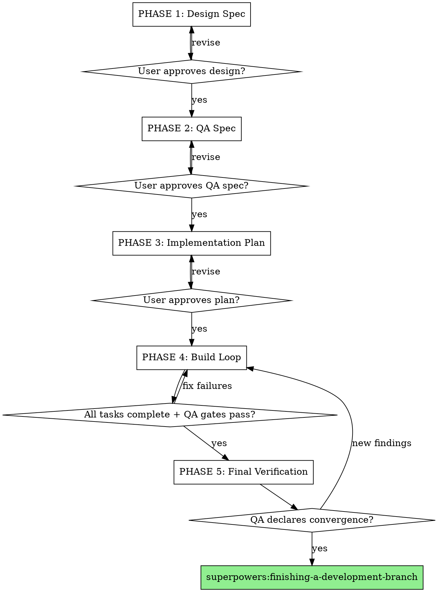
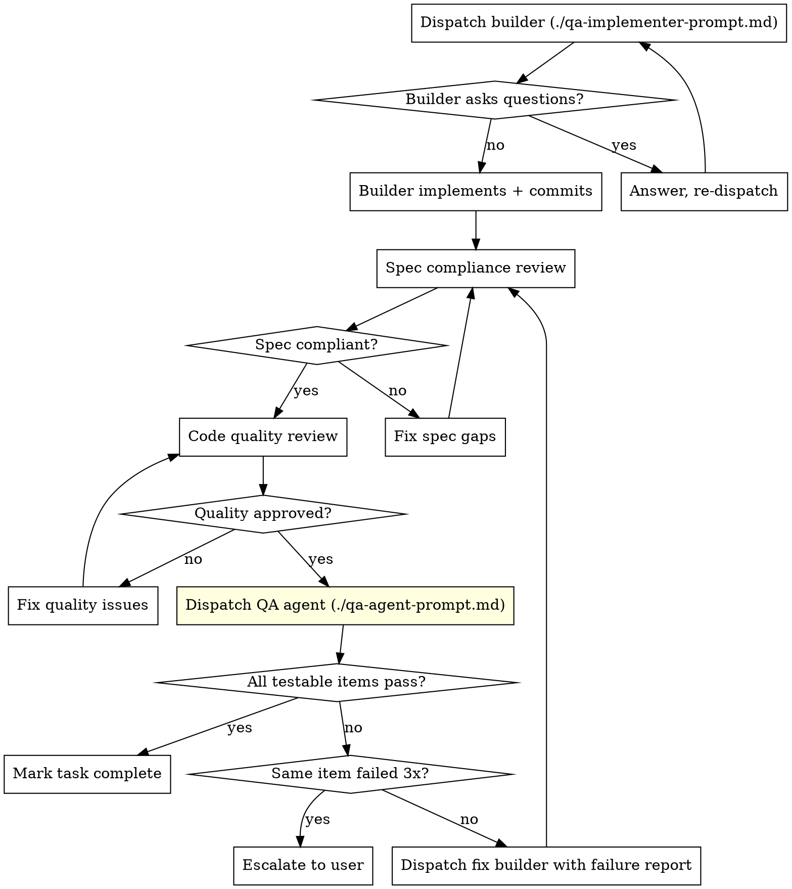

# QA-Driven Development

Orchestrate feature development with a QA-contract-first methodology. Separate the agent that builds from the agent that judges. The QA specification exists before any code is written and drives the entire build.

**Core insight:** Builder agents exhibit self-evaluation bias — they write QA that validates what they built, not what was specified. This skill enforces an independent QA agent that owns the contract and declares convergence.

## When to Use

**Use this when:**
- Web apps with multiple routes, forms, and interactive elements
- Features where "compiles and tests pass" isn't enough
- Prior experience with stub-first architecture or placeholder convergence
- Multi-task builds where behavioral correctness matters

**Don't use for:**
- Pure library/utility code (unit tests are sufficient)
- Single-file changes
- Documentation-only work

## The Five Phases

### Phase 1: Design Spec

Invoke `superpowers:brainstorming` as normal. Explore context, ask questions, propose approaches, present design section by section.

**CRITICAL INTERCEPTION:** When brainstorming completes and the user approves the design spec, do NOT proceed to `superpowers:writing-plans`. Instead, return control here for Phase 2. Tell the user:

> "Design spec approved. Before planning implementation, I'll generate a QA specification — the behavioral contract that will drive and verify the build."

### Phase 2: QA Spec

Dispatch a QA agent subagent using the `qa-specification` skill.

**Inputs to QA agent:**
- Path to the approved design spec
- Project context (tech stack, directory structure, existing patterns)

**QA agent outputs:**
- QA spec file: `docs/superpowers/qa/YYYY-MM-DD-<feature>-qa-spec.md`
- QA state file: `docs/superpowers/qa/YYYY-MM-DD-<feature>-qa-state.yaml`

Present the QA spec to the user for review. User can add or reword items but never remove them.

### Phase 3: Implementation Plan

Invoke `superpowers:writing-plans` with **both** the design spec and QA spec as inputs.

Tell the planning skill:
> "Each task will face QA verification. The QA spec at [path] defines what will be tested. Plan tasks knowing that QA items tagged with `testable_after: task_N` must pass before the next task begins."

After the plan is approved, dispatch a QA agent subagent to map each QA item to `testable_after: task_N` in the state file.

### Phase 4: Build Loop

Invoke `superpowers:using-git-worktrees` if not already in a worktree.

**Per task:**

**QA gate rules:**
- QA agent evaluates all items where `testable_after <= current_task`
- The testable set monotonically grows as tasks complete
- ALL currently-testable items must pass — zero tolerance
- A fix can break something else, so QA re-evaluates ALL testable items each run
- 3 failures on the same item → escalate to user

**Builder QA_PROPOSALS:** The builder can propose new QA items via a structured block (see `./qa-implementer-prompt.md`). The QA agent decides whether to accept (append to spec) or reject (note in state).

### Phase 5: Final Verification

Dispatch QA agent for a full-spec run (no `testable_after` scoping — every item must pass).

**Discovery sweep:** QA agent independently explores the running app:
- Navigate every route
- Try every form, button, interactive element
- Check console for errors
- Look for placeholder text, stubs, broken assets
- New findings → append to spec → must also pass

**Convergence criteria (ALL must be true):**
1. 100% pass rate on full QA spec
2. Discovery sweep finds zero new failing items
3. QA agent explicitly declares convergence

**If not converged:** Builder fixes → QA re-runs → loop until converged.

Then invoke `superpowers:finishing-a-development-branch`.

## Agent Boundaries — The Hard Wall

| | Builder | QA Agent | Reviewers |
|---|---|---|---|
| **Reads** | Design spec, QA spec (read-only), plan, codebase | Design spec, QA spec, QA state, codebase, running app | Code changes, plan |
| **Writes** | Source code, test files | QA spec (append only), QA state | Review verdicts |
| **Cannot touch** | QA spec, QA state | Source code, test files, plan | QA spec, QA state |

The builder never writes QA. The QA agent never writes code. Communication happens through structured artifacts only.

## Prompt Templates

- `./qa-implementer-prompt.md` — Builder subagent (reads QA spec, proposes additions, cannot modify)
- `./qa-agent-prompt.md` — QA agent subagent (owns QA spec and state, verifies independently)
- Spec compliance and code quality reviewers use existing `superpowers:subagent-driven-development` templates unchanged

## File Outputs

| File | Location | Owner |
|------|----------|-------|
| Design spec | `docs/superpowers/specs/YYYY-MM-DD-<feature>-design.md` | Brainstorming |
| QA spec | `docs/superpowers/qa/YYYY-MM-DD-<feature>-qa-spec.md` | QA agent (append-only) |
| QA state | `docs/superpowers/qa/YYYY-MM-DD-<feature>-qa-state.yaml` | QA agent |
| Impl plan | `docs/superpowers/plans/YYYY-MM-DD-<feature>.md` | Planning |

## Integration with Existing Superpowers

This skill layers on top — it does not replace or fork existing skills:

| Phase | Existing Skill | What's Added |
|-------|---------------|--------------|
| Design | `superpowers:brainstorming` | Orchestrator intercepts before writing-plans |
| QA spec | — | New: `qa-specification` skill |
| Plan | `superpowers:writing-plans` | Plan reads QA spec as input |
| Build | `superpowers:subagent-driven-development` | QA gate after each task's two-stage review |
| Review | `superpowers:requesting-code-review` | Unchanged, runs before QA gate |
| Finish | `superpowers:finishing-a-development-branch` | Unchanged, runs after convergence |
| Worktrees | `superpowers:using-git-worktrees` | Unchanged |

## Red Flags

**Never:**
- Let the builder modify the QA spec or state files
- Let the QA agent modify source code or test files
- Skip the QA gate between tasks ("tests pass, good enough")
- Accept builder's self-report as evidence (QA agent verifies independently)
- Remove or weaken QA spec items under pressure
- Declare convergence without QA agent's explicit verdict
- Proceed to next task with any testable QA item failing

**If QA agent finds issues the builder says are "by design":**
- The QA spec is the contract. If the spec says X, X must work.
- If the spec is wrong, the user (not the builder) decides whether to amend it.
- Builder proposes via QA_PROPOSALS. QA agent or user decides.
