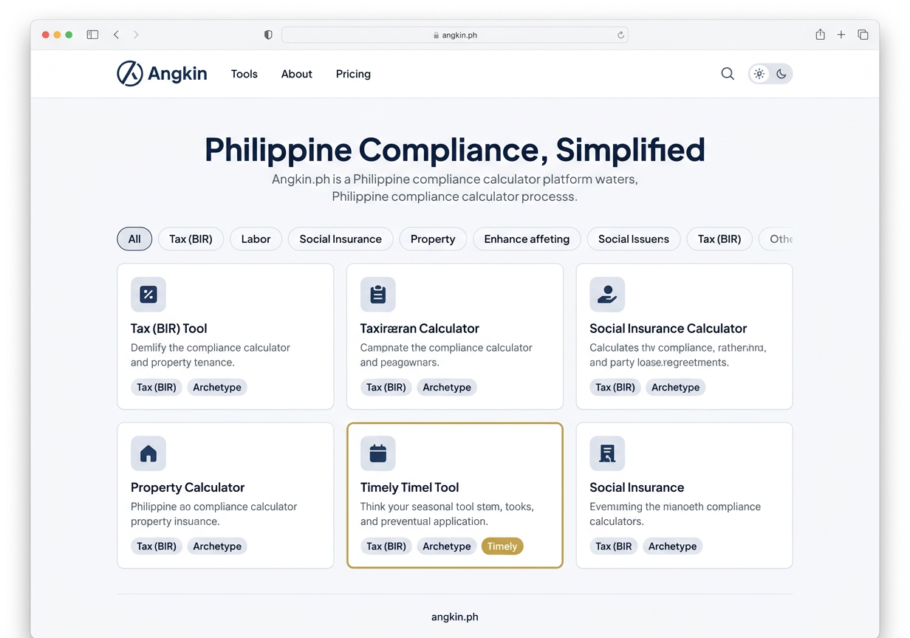
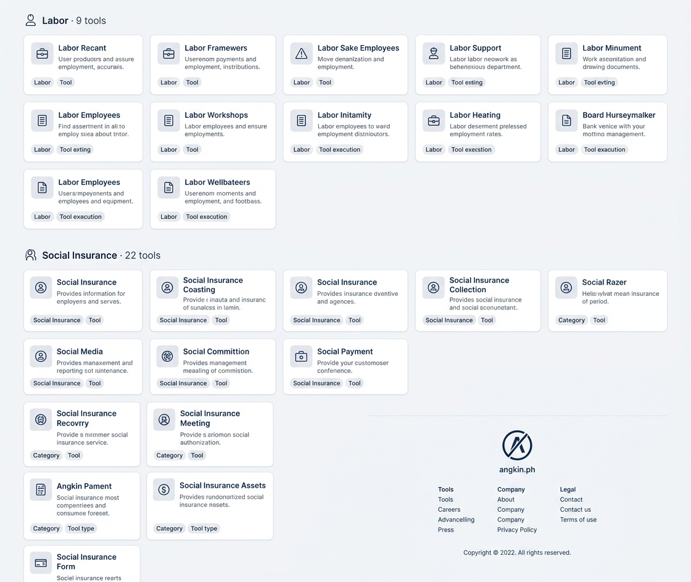
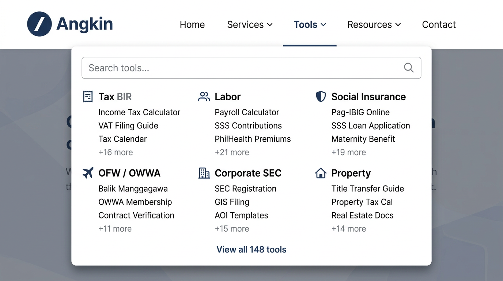

# 4.1 — Angkin Platform Home (Desktop 1280px)

## Screen Purpose

The Angkin platform home is the front door to 148 Philippine compliance calculator tools. It must:
1. Establish Angkin as a trustworthy, institutional brand (not a startup toy)
2. Let users find tools fast — by category, by search, by browsing
3. Surface seasonally relevant tools (gold "Timely" treatment)
4. Scale gracefully from 6 tools at launch to 148 at full build-out

## Page Structure

```
┌─────────────────────────────────────────────────────────────┐
│  Top Bar (64px) — logo, nav links, search, theme toggle     │
├─────────────────────────────────────────────────────────────┤
│                                                              │
│  Hero Section (96px vertical padding)                        │
│    "Philippine Compliance, Simplified"                       │
│    Subtext describing the platform purpose                   │
│                                                              │
├─────────────────────────────────────────────────────────────┤
│  Category Tab Bar — [All] [Tax] [Labor] [Social Ins.] ...   │
├─────────────────────────────────────────────────────────────┤
│                                                              │
│  Tool Card Grid (3-column, 1120px max-width)                 │
│                                                              │
│  ┌─────────┐  ┌─────────┐  ┌─────────┐                     │
│  │ Tool 1  │  │ Tool 2  │  │ Tool 3  │  ← Standard cards   │
│  └─────────┘  └─────────┘  └─────────┘                     │
│                                                              │
│  ┌─────────┐  ┌═════════┐  ┌─────────┐                     │
│  │ Tool 4  │  ║Featured ║  │ Tool 6  │  ← Gold border      │
│  └─────────┘  └═════════┘  └─────────┘                     │
│                                                              │
│  ... grouped by category sections ...                        │
│                                                              │
│  ── Labor · 9 tools ──                                       │
│  [cards...]                                                  │
│                                                              │
│  ── Social Insurance · 22 tools ──                           │
│  [cards...]                                                  │
│                                                              │
├─────────────────────────────────────────────────────────────┤
│  Footer — logo, link columns, copyright                      │
└─────────────────────────────────────────────────────────────┘
```

## Design Decisions for This Screen

### Hero Treatment

- **Heading**: "Philippine Compliance, Simplified" — Plus Jakarta Sans 800 (extrabold), 48px (`--text-hero`), navy-600, tight tracking (-0.025em)
- **Subtext**: DM Sans 400, 16px, neutral-500, max-width 520px centered
- **Vertical padding**: 96px top and bottom (`--hero-padding-desktop`)
- **Background**: `--neutral-50` (#F7F8FA) — subtle distinction from the white card area below
- **No illustration, no graphic** — the 2C logo in the nav is the visual anchor. The hero is text-only. Compliance tools don't need hero images.

### Category Filter Bar

- Horizontal pill/chip filter using the tab bar pattern from 3.4
- "All" is selected by default (navy-600 text, 2px bottom border)
- On click, the grid filters to show only that category's tools
- Desktop: all 14 categories visible in a single row (may scroll at narrow desktop widths)
- The bar sits at the boundary between hero and grid — sticky below the nav on scroll

### Tool Card Grid

- **Container**: 1120px max-width (`--content-full`)
- **Grid**: `repeat(auto-fill, minmax(280px, 1fr))`, gap 24px (`--grid-gap-loose`)
- **Card spec**: Defined in 2.5 — category icon (duotone, 40px container), name, description (2-line clamp), meta badges
- **Featured card**: Gold border (2px), "Timely" badge positioned top-right. Used for 2-4 seasonally relevant tools.
- **Category sections**: When "All" is selected, tools are grouped under category headings with format: `[Category Icon] Category Name · N tools`. Each heading uses `--text-h3` (20px, Plus Jakarta Sans semibold).

### Footer

- **Background**: white (`--neutral-0`), top border 1px `--neutral-200`
- **Layout**: Centered, 3-column link groups (Tools, Company, Legal) flanking a centered logo lockup
- **Logo**: 32px mark + "angkin.ph" text
- **Copyright**: DM Sans 12px, neutral-400, bottom
- **Padding**: 64px top, 32px bottom

### Tools Mega-Menu

- Triggered by hovering/clicking "Tools" in the top bar
- 720px dropdown, 3-column grid of categories
- Each category: icon + label (uppercase, 13px semibold) + top 3 tool links + "+N more"
- Search input at top for instant filtering
- "View all 148 tools" link at bottom
- Backdrop dimming behind the dropdown

## Generated Mockups

### 1. Full Page View (Hero + Grid + Nav)


Shows the complete above-the-fold view: top bar with Angkin logo and nav, hero heading, category filter tabs, and 2 rows of tool cards with one featured (gold border + "Timely" badge).

### 2. Scrolled View (Category Sections + Footer)


Shows the continuation below the fold: category section headings ("Labor · 9 tools", "Social Insurance · 22 tools"), continued card grid, and the footer with logo + link columns.

### 3. Tools Mega-Menu Dropdown


Shows the tools dropdown triggered from the top bar: search input, 3-column category grid with icons and tool links, "View all 148 tools" CTA.

## Key CSS for This Screen

```css
/* Hero Section */
.platform-hero {
  background: var(--neutral-50);
  padding: var(--hero-padding-desktop) 0;
  text-align: center;
}

.platform-hero__title {
  font-family: var(--font-heading);
  font-size: var(--text-hero);
  font-weight: var(--weight-extrabold);
  line-height: var(--leading-hero);
  letter-spacing: var(--tracking-hero);
  color: var(--navy-600);
  margin: 0 0 var(--space-4);
}

.platform-hero__subtitle {
  font-family: var(--font-body);
  font-size: 16px;
  font-weight: var(--weight-regular);
  color: var(--neutral-500);
  line-height: 1.6;
  max-width: 520px;
  margin: 0 auto;
}

/* Category Section Heading */
.category-heading {
  display: flex;
  align-items: center;
  gap: var(--space-3);
  font-family: var(--font-heading);
  font-size: var(--text-h3);
  font-weight: var(--weight-semibold);
  color: var(--neutral-800);
  padding: var(--space-8) 0 var(--space-4);
  border-bottom: 1px solid var(--neutral-200);
  margin-bottom: var(--space-6);
}

.category-heading__count {
  font-family: var(--font-body);
  font-size: var(--text-small);
  font-weight: var(--weight-regular);
  color: var(--neutral-400);
}

/* Footer */
.platform-footer {
  border-top: 1px solid var(--neutral-200);
  padding: var(--space-16) 0 var(--space-8);
  background: var(--neutral-0);
}

.platform-footer__inner {
  max-width: var(--content-full);
  margin: 0 auto;
  padding: 0 var(--container-padding-desktop);
  display: grid;
  grid-template-columns: 1fr repeat(3, auto);
  gap: var(--space-16);
}

.platform-footer__brand {
  display: flex;
  flex-direction: column;
  gap: var(--space-3);
}

.platform-footer__links-group h4 {
  font-family: var(--font-heading);
  font-size: var(--text-xs);
  font-weight: var(--weight-semibold);
  text-transform: uppercase;
  letter-spacing: var(--tracking-overline);
  color: var(--neutral-400);
  margin-bottom: var(--space-3);
}

.platform-footer__links-group a {
  display: block;
  font-family: var(--font-body);
  font-size: var(--text-small);
  color: var(--neutral-600);
  text-decoration: none;
  padding: var(--space-1) 0;
  transition: color var(--duration-fast);
}

.platform-footer__links-group a:hover {
  color: var(--navy-600);
}

.platform-footer__copyright {
  grid-column: 1 / -1;
  font-family: var(--font-body);
  font-size: var(--text-xs);
  color: var(--neutral-400);
  padding-top: var(--space-8);
  border-top: 1px solid var(--neutral-200);
  text-align: center;
}
```

## Notes

- **Logo reference image** (`docs/brand/angkin/direction-02c-radical-clarity.png`) was not available in this environment, so mockups were generated without the `-r` reference flag. The AI approximated the logo as a circle with diagonal slash, which is close but not pixel-perfect to the actual 2C Radical Clarity mark.
- The generated mockups have garbled placeholder text (typical of image generation models) — the actual tool names, descriptions, and category labels are defined in the analysis files (2.5, 2.6) and will be rendered correctly in the HTML treatment deck (Wave 5).
- This screen uses the widest content container (`--content-full: 1120px`) to accommodate the 3-column tool card grid.

---

*Platform home mockup complete. Three views generated: above-the-fold hero + grid, scrolled category sections + footer, and tools mega-menu dropdown. All follow the design tokens defined in Waves 1-3.*
