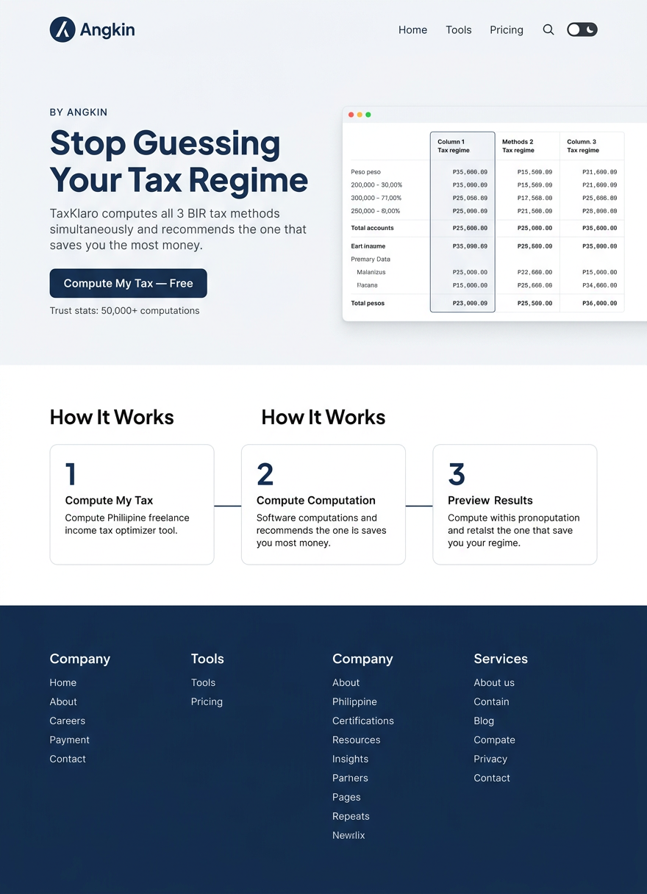
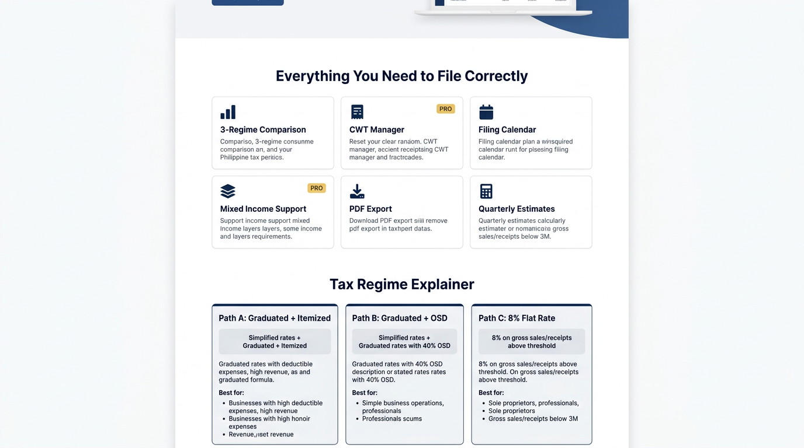

# 4.2 — TaxKlaro Landing Page (Desktop 1280px)

## Screen Purpose

TaxKlaro is Angkin's flagship tool — a Philippine freelance income tax optimizer that computes all 3 BIR tax methods simultaneously. The landing page must:
1. Lead with the pain point (regime confusion) not the feature (computation)
2. Show the "result moment" early — the 3-regime comparison is the product
3. Establish TaxKlaro as an Angkin tool ("by Angkin" badge, shared nav)
4. Convert visitors to free computation (no signup wall for first use)

## Page Structure

```
┌─────────────────────────────────────────────────────────────┐
│  Top Bar (64px) — Angkin logo, nav (Home, Tools, Pricing),  │
│                   search, theme toggle                       │
├─────────────────────────────────────────────────────────────┤
│                                                              │
│  Hero Section (neutral-50 background)                        │
│  ┌──────────────────────┬──────────────────────┐            │
│  │  Overline: BY ANGKIN  │                      │            │
│  │  H1: Stop Guessing    │  [Regime Comparison  │            │
│  │  Your Tax Regime      │   Table Preview]     │            │
│  │  Subtitle: TaxKlaro   │   Path A | B | C     │            │
│  │  computes all 3...    │   with peso amounts  │            │
│  │  [Compute My Tax]     │                      │            │
│  │  50K+ computations    │                      │            │
│  └──────────────────────┴──────────────────────┘            │
│                                                              │
├─────────────────────────────────────────────────────────────┤
│  How It Works — 3 numbered steps with connectors             │
│  [1. Enter Income] → [2. We Compute All 3] → [3. See Best] │
├─────────────────────────────────────────────────────────────┤
│                                                              │
│  Features Grid — 2×3 cards                                   │
│  ┌────────┐  ┌────────┐  ┌────────┐                        │
│  │3-Regime│  │  CWT   │  │ Filing │                        │
│  │Compare │  │Manager │  │Calendar│                        │
│  └────────┘  └────────┘  └────────┘                        │
│  ┌────────┐  ┌────────┐  ┌────────┐                        │
│  │ Mixed  │  │  PDF   │  │Quarterly│                       │
│  │Income  │  │ Export │  │Estimates│                       │
│  └────────┘  └────────┘  └────────┘                        │
│                                                              │
├─────────────────────────────────────────────────────────────┤
│  Tax Regime Explainer — 3 path cards side by side            │
│  [Path A: Graduated    [Path B: Graduated    [Path C: 8%    │
│   + Itemized]           + OSD 40%]            Flat Rate]    │
│  Formula, best-for     Formula, best-for     Formula, cap  │
├─────────────────────────────────────────────────────────────┤
│  Social Proof — navy background, 4 stats in white           │
│  50,000+ | ₱2.1B+ | 3 Regimes | 99.9% Accuracy            │
├─────────────────────────────────────────────────────────────┤
│  Pricing — 3 tiers (Free / Pro / Enterprise)                │
│  Pro card elevated with gold "Most Popular" badge           │
├─────────────────────────────────────────────────────────────┤
│  Final CTA — navy bg, "Ready to Optimize?" + button        │
├─────────────────────────────────────────────────────────────┤
│  Footer — Angkin logo, link columns, copyright              │
└─────────────────────────────────────────────────────────────┘
```

## Design Decisions for This Screen

### Hero: Two-Column with Product Preview

- **Left column** (55% width): Copy-driven
  - Overline: "BY ANGKIN" — 11px, uppercase, tracking-overline (0.08em), navy-400. Establishes parent brand.
  - H1: "Stop Guessing Your Tax Regime" — 48px (`--text-hero`), Plus Jakarta Sans 800, navy-600. Pain-point-first headline.
  - Subtitle: "TaxKlaro computes all 3 BIR-allowed tax methods simultaneously and recommends the one that saves you the most money." — 16px DM Sans 400, neutral-500, max-width 480px.
  - Primary CTA: "Compute My Tax — Free" — navy-600 button, 48px height (large), 15px semibold. The "Free" removes friction.
  - Trust indicator: "50,000+ computations" — 13px, neutral-400, with a subtle checkmark icon.

- **Right column** (45% width): Product screenshot
  - A clean, styled preview of the 3-regime comparison table showing realistic peso amounts
  - Shadow-lg, radius-lg, subtle rotation (2deg) for depth
  - This is NOT an illustration — it's a representation of actual UI, establishing credibility

- **Background**: neutral-50 (#F7F8FA) — same as platform home hero
- **Vertical padding**: 80px top, 96px bottom (asymmetric — more space below to separate from How It Works)

### How It Works: 3-Step Walkthrough

- Three cards connected by a thin line (navy-200, 2px)
- Each card: numbered circle (navy-600, 40px, white number), heading (17px semibold), description (13px neutral-500)
- Steps: (1) Enter your annual income and expenses → (2) TaxKlaro computes all 3 BIR tax methods → (3) See which regime saves you the most
- White background, 960px max-width centered

### Features Grid: 2×3 Cards

- Section heading: "Everything You Need to File Correctly" — 30px (`--text-h1`), Plus Jakarta Sans 700, centered
- 6 feature cards at 960px max-width, 3-column grid, 24px gap
- Each card: icon (Phosphor, 24px, navy-400), heading (17px semibold, navy-800), description (15px, neutral-500)
- PRO features get a small gold-400 "PRO" badge (12px, uppercase, gold-50 bg, gold-600 text, pill shape)
- Features:
  1. **3-Regime Comparison** — "See all tax paths side by side with exact peso amounts"
  2. **CWT Manager** [PRO] — "Track 2307 withholding certificates and auto-apply credits"
  3. **Filing Calendar** — "Never miss a quarterly deadline with BIR date reminders"
  4. **Mixed Income** — "Handle employment + freelance income in one computation"
  5. **PDF Export** [PRO] — "Download professional computation reports for your CPA"
  6. **Quarterly Estimates** — "Know exactly how much to set aside each quarter"

### Tax Regime Explainer: 3 Path Cards

- Three cards at 960px max-width, equal width, 16px gap
- Card structure: path letter badge (A/B/C in circle, 32px), regime name as heading, formula in mono, 2-3 "Best for" bullet points, "Learn more" ghost link
- The "recommended" card (Path C for most freelancers) gets a subtle success-50 background and success-500 border — but this is illustrative, not prescriptive

### Social Proof Strip

- Full-width navy-600 background
- 4 stats at 960px max-width, evenly spaced
- Number: 36px (`--text-display`), Plus Jakarta Sans 700, white
- Label: 13px DM Sans 400, navy-200 (80% white)
- Stats: "50,000+ Computations", "₱2.1B+ Computed", "3 Tax Regimes", "99.9% Accuracy"

### Pricing Section

- 3 tier cards at 960px max-width
- **Free**: White card, neutral border. Core computation, 1/day limit.
- **Pro**: Elevated (shadow-md), gold-400 top border (3px), "Most Popular" gold badge. ₱299/year. CWT, PDF, unlimited.
- **Enterprise**: White card, neutral border. API, batch, CPA dashboard. "Contact us."
- Price in IBM Plex Mono 600 (`--peso-display` size) — the pricing IS a peso amount moment

### Final CTA Band

- Navy-700 background (slightly darker than social proof strip for variety)
- "Ready to Optimize Your Taxes?" — 30px white
- Ghost button with white border: "Get Started Free"
- Centered, 64px vertical padding

### Footer

- Shared Angkin footer (defined in 4.1) — not TaxKlaro-specific
- Reinforces that TaxKlaro is part of the Angkin ecosystem

## Generated Mockups

### 1. Hero + How It Works


Shows the two-column hero: pain-point headline + product preview on the left, regime comparison table preview on the right. Below: 3-step "How It Works" walkthrough with connected cards.

### 2. Features Grid + Regime Explainer


Shows the 2×3 feature card grid with PRO badges, followed by the 3-path regime explainer cards with formulas and "Best for" descriptions.

### 3. Social Proof + Pricing + CTA + Footer


Shows the navy social proof statistics strip, 3-tier pricing cards with elevated PRO option, final CTA band, and the shared Angkin footer.

## Key CSS for This Screen

```css
/* TaxKlaro Hero — Two Column */
.tk-hero {
  background: var(--neutral-50);
  padding: 80px 0 96px;
}

.tk-hero__inner {
  max-width: var(--content-default); /* 960px */
  margin: 0 auto;
  padding: 0 var(--container-padding-desktop);
  display: grid;
  grid-template-columns: 55% 45%;
  gap: var(--space-12);
  align-items: center;
}

.tk-hero__overline {
  font-family: var(--font-body);
  font-size: var(--text-overline);
  font-weight: var(--weight-semibold);
  letter-spacing: var(--tracking-overline);
  text-transform: uppercase;
  color: var(--navy-400);
  margin-bottom: var(--space-4);
}

.tk-hero__title {
  font-family: var(--font-heading);
  font-size: var(--text-hero);
  font-weight: var(--weight-extrabold);
  line-height: var(--leading-hero);
  letter-spacing: var(--tracking-hero);
  color: var(--navy-600);
  margin-bottom: var(--space-4);
}

.tk-hero__subtitle {
  font-family: var(--font-body);
  font-size: 1rem; /* 16px */
  font-weight: var(--weight-regular);
  line-height: 1.6;
  color: var(--neutral-500);
  max-width: 480px;
  margin-bottom: var(--space-8);
}

.tk-hero__preview {
  background: var(--neutral-0);
  border: 1px solid var(--neutral-200);
  border-radius: var(--radius-lg);
  box-shadow: var(--shadow-lg);
  overflow: hidden;
  transform: rotate(1.5deg);
}

/* How It Works */
.tk-steps {
  max-width: var(--content-default);
  margin: 0 auto;
  padding: var(--space-16) var(--container-padding-desktop);
  display: grid;
  grid-template-columns: repeat(3, 1fr);
  gap: var(--space-8);
  position: relative;
}

.tk-steps::before {
  content: '';
  position: absolute;
  top: 44px; /* center of the 40px numbered circle + padding */
  left: calc(16.67% + 20px);
  right: calc(16.67% + 20px);
  height: 2px;
  background: var(--navy-200);
}

.tk-step__number {
  width: 40px;
  height: 40px;
  border-radius: 50%;
  background: var(--navy-600);
  color: white;
  display: flex;
  align-items: center;
  justify-content: center;
  font-family: var(--font-heading);
  font-size: var(--text-body);
  font-weight: var(--weight-semibold);
  margin-bottom: var(--space-4);
  position: relative;
  z-index: 1;
}

/* Features Grid */
.tk-features {
  max-width: var(--content-default);
  margin: 0 auto;
  padding: var(--space-16) var(--container-padding-desktop);
}

.tk-features__grid {
  display: grid;
  grid-template-columns: repeat(3, 1fr);
  gap: var(--space-6);
  margin-top: var(--space-10);
}

.tk-feature-card {
  background: var(--neutral-0);
  border: 1px solid var(--neutral-200);
  border-radius: var(--radius-lg);
  padding: var(--space-6);
}

.tk-feature-card__badge-pro {
  font-size: var(--text-xs);
  font-weight: var(--weight-semibold);
  text-transform: uppercase;
  letter-spacing: var(--tracking-wider);
  color: var(--gold-600);
  background: var(--gold-50);
  padding: 2px 8px;
  border-radius: 999px;
}

/* Social Proof Strip */
.tk-social-proof {
  background: var(--navy-600);
  padding: var(--space-12) 0;
}

.tk-social-proof__inner {
  max-width: var(--content-default);
  margin: 0 auto;
  display: grid;
  grid-template-columns: repeat(4, 1fr);
  gap: var(--space-8);
  text-align: center;
}

.tk-social-proof__number {
  font-family: var(--font-heading);
  font-size: var(--text-display);
  font-weight: var(--weight-bold);
  color: white;
  line-height: var(--leading-display);
}

.tk-social-proof__label {
  font-family: var(--font-body);
  font-size: var(--text-small);
  color: var(--navy-200);
  margin-top: var(--space-1);
}

/* Pricing Cards */
.tk-pricing__grid {
  display: grid;
  grid-template-columns: repeat(3, 1fr);
  gap: var(--space-6);
  max-width: var(--content-default);
  margin: 0 auto;
  align-items: start;
}

.tk-pricing-card--pro {
  border-top: 3px solid var(--gold-400);
  box-shadow: var(--shadow-md);
  position: relative;
}

.tk-pricing-card__price {
  font-family: var(--font-mono);
  font-size: var(--peso-display);
  font-weight: var(--weight-semibold);
  color: var(--navy-600);
  font-variant-numeric: tabular-nums;
}

/* Final CTA */
.tk-cta-band {
  background: var(--navy-700);
  padding: var(--space-16) 0;
  text-align: center;
}

.tk-cta-band__title {
  font-family: var(--font-heading);
  font-size: var(--text-h1);
  font-weight: var(--weight-bold);
  color: white;
  margin-bottom: var(--space-6);
}

.tk-cta-band__button {
  display: inline-flex;
  align-items: center;
  height: 48px;
  padding: 0 32px;
  border: 2px solid white;
  border-radius: var(--radius-default);
  color: white;
  background: transparent;
  font-family: var(--font-body);
  font-size: var(--text-body);
  font-weight: var(--weight-semibold);
  cursor: pointer;
  transition: background var(--duration-fast), color var(--duration-fast);
}

.tk-cta-band__button:hover {
  background: white;
  color: var(--navy-700);
}
```

## Relationship to Platform

TaxKlaro's landing page follows the shared Angkin pattern:
- **Same top nav** as platform home (Angkin logo, shared nav links)
- **Breadcrumb**: Angkin › Tax › TaxKlaro
- **"BY ANGKIN" overline** in the hero — reinforces parent brand
- **Shared footer** — identical to platform home
- **No TaxKlaro-specific accent color** — uses the system navy throughout (per 2.5 sub-tool branding decision)

The only TaxKlaro-specific elements are the content (copy, features, pricing) and the regime explainer cards. All visual tokens come from the shared Angkin design system.

## Notes

- Logo reference image not available in CI — mockups generated without `-r` flag. AI approximated the logo mark.
- Generated mockup text may have rendering artifacts typical of image generation models — actual text will be pixel-perfect in the HTML treatment deck (Wave 5).
- The pricing shown (₱299/year for Pro) comes from the TaxKlaro mega spec. Enterprise pricing is "Contact us."
- The page reuses the platform home's nav bar and footer exactly, reinforcing that TaxKlaro is a tool within Angkin, not a separate product.

---

*TaxKlaro landing page mockup complete. Three views generated: hero + how-it-works, features + regime explainer, social proof + pricing + CTA + footer. All follow Angkin design system tokens from Waves 1-3.*
