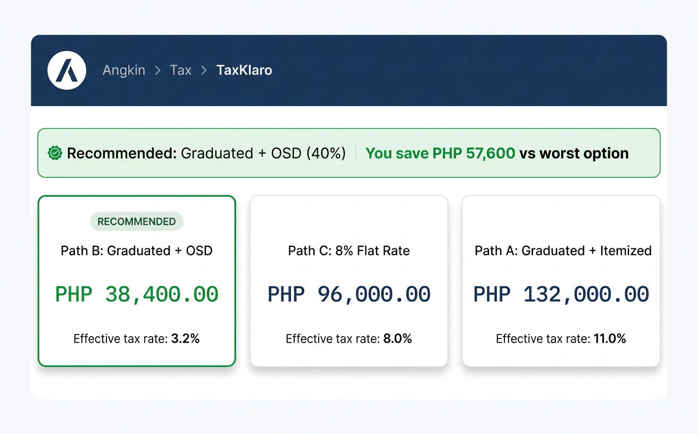
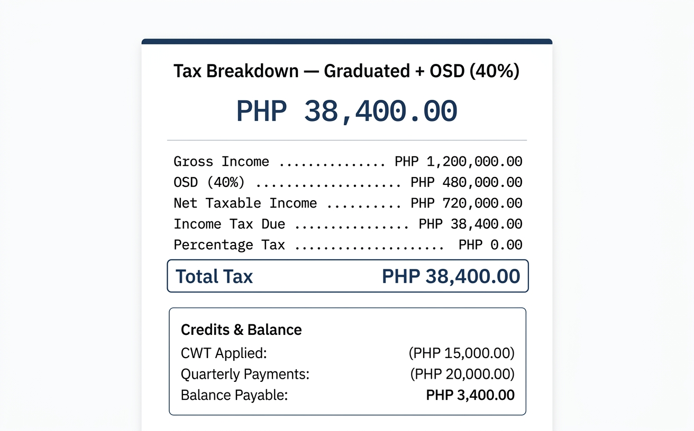
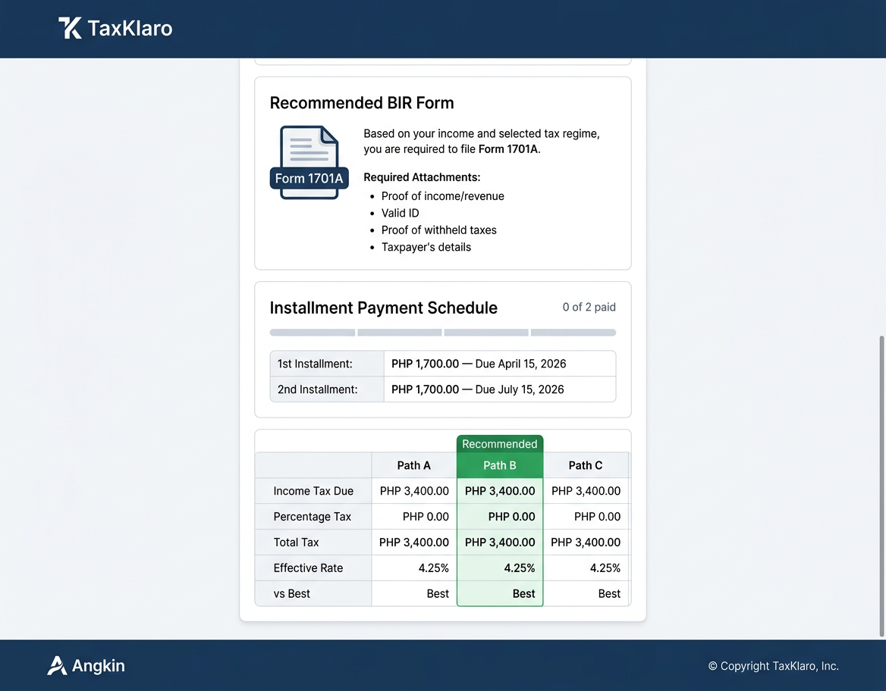

# 4.3 — TaxKlaro Results Page (Desktop 1280px)

## Screen Purpose

The results page is **the payoff** — the moment a Filipino freelancer sees exactly how much tax they owe across all 3 BIR-allowed regimes. TaxKlaro computes Paths A (Graduated + Itemized), B (Graduated + OSD 40%), and C (8% Flat Rate) simultaneously, recommends the cheapest, and shows the savings.

This is the most data-dense screen in the Angkin platform. Every design decision serves one goal: **make the optimal regime unmistakable and the numbers trustworthy.**

## Page Structure

```
┌─────────────────────────────────────────────────────────────┐
│  Top Nav (64px) — Angkin logo, nav links, theme toggle       │
│  Breadcrumb: Angkin › Tax › TaxKlaro › Results              │
├─────────────────────────────────────────────────────────────┤
│                                                              │
│  Recommendation Banner                                       │
│  ┌──────────────────────────────────────────────────────┐   │
│  │  ✓ Recommended: Graduated + OSD (40%)                │   │
│  │    You save ₱57,600 vs worst option                  │   │
│  └──────────────────────────────────────────────────────┘   │
│                                                              │
│  Regime Comparison Cards (3 across)                          │
│  ┌─ RECOMMENDED ──┐  ┌───────────────┐  ┌───────────────┐  │
│  │ Path B: OSD    │  │ Path C: 8%    │  │ Path A: Item  │  │
│  │ ₱38,400.00     │  │ ₱96,000.00    │  │ ₱132,000.00   │  │
│  │ Eff: 3.2%      │  │ Eff: 8.0%     │  │ Eff: 11.0%    │  │
│  └────────────────┘  └───────────────┘  └───────────────┘  │
│                                                              │
├─────────────────────────────────────────────────────────────┤
│                                                              │
│  Tax Breakdown Card (recommended path)                       │
│  ┌──────────────────────────────────────────────────────┐   │
│  │  Tax Breakdown — Graduated + OSD (40%)               │   │
│  │                                                      │   │
│  │         ₱38,400.00                                   │   │
│  │  ──────────────────────────────────                  │   │
│  │  Gross Income ............. ₱1,200,000.00            │   │
│  │  OSD (40%) ............... ₱480,000.00               │   │
│  │  Net Taxable Income ...... ₱720,000.00               │   │
│  │  Income Tax Due .......... ₱38,400.00                │   │
│  │  Percentage Tax .......... ₱0.00                     │   │
│  │  ──────────────────────────────────                  │   │
│  │  Total Tax                  ₱38,400.00               │   │
│  └──────────────────────────────────────────────────────┘   │
│                                                              │
├─────────────────────────────────────────────────────────────┤
│                                                              │
│  Credits & Balance Card                                      │
│  ┌──────────────────────────────────────────────────────┐   │
│  │  CWT Applied ............. (₱15,000.00)              │   │
│  │  Quarterly Payments ...... (₱20,000.00)              │   │
│  │  ──────────────────────────────────                  │   │
│  │  Balance Payable          ₱3,400.00                  │   │
│  └──────────────────────────────────────────────────────┘   │
│                                                              │
├─────────────────────────────────────────────────────────────┤
│                                                              │
│  Recommended BIR Form Card                                   │
│  ┌──────────────────────────────────────────────────────┐   │
│  │  [Form 1701A badge]  Based on your income and        │   │
│  │  selected regime, file Form 1701A.                   │   │
│  │  Required Attachments:                               │   │
│  │  • Proof of income/revenue                           │   │
│  │  • Valid ID                                          │   │
│  │  • Proof of withheld taxes                           │   │
│  └──────────────────────────────────────────────────────┘   │
│                                                              │
├─────────────────────────────────────────────────────────────┤
│                                                              │
│  Installment Payment Schedule Card                           │
│  ┌──────────────────────────────────────────────────────┐   │
│  │  [══░░░] 0 of 2 paid                                │   │
│  │  1st: ₱1,700.00 — Due April 15, 2026                │   │
│  │  2nd: ₱1,700.00 — Due July 15, 2026                 │   │
│  └──────────────────────────────────────────────────────┘   │
│                                                              │
├─────────────────────────────────────────────────────────────┤
│                                                              │
│  Full Comparison Table                                       │
│  ┌──────────┬──────────┬──────────┬──────────┐             │
│  │          │  Path A  │ Path B ★ │  Path C  │             │
│  │ IT Due   │ ₱132,000 │ ₱38,400  │ ₱96,000  │             │
│  │ PT       │    —     │    —     │ ₱36,000  │             │
│  │ Total    │ ₱132,000 │ ₱38,400  │ ₱132,000 │             │
│  │ Eff Rate │  11.0%   │   3.2%   │  11.0%   │             │
│  │ vs Best  │ +₱93,600 │    —     │ +₱93,600 │             │
│  └──────────┴──────────┴──────────┴──────────┘             │
│                                                              │
├─────────────────────────────────────────────────────────────┤
│  Footer — Angkin logo, links, copyright                      │
└─────────────────────────────────────────────────────────────┘
```

## Design Decisions for This Screen

### 1. Recommendation Banner (Top Priority)

The first thing the user sees after computation is the verdict.

- **Green success background** (`--success-50`) with left border (`--success-500`, 3px)
- **"Recommended: Graduated + OSD (40%)"** — Plus Jakarta Sans 600, 16px, success-700
- **Savings callout**: "You save ₱57,600 vs worst option" — IBM Plex Mono, success-600, right-aligned
- Maximum width matches content area (960px)
- This banner is sticky-positioned during scroll until the user scrolls past the comparison cards

### 2. Regime Comparison Cards (The Hero Moment)

Three result cards in a 3-column grid at 960px. This is the regime comparison component from analysis 3.3.

- **Recommended card**: `.result-card--optimal` — green border, success-50 background, "RECOMMENDED" pill badge, peso amount in success-600
- **Other cards**: `.result-card--suboptimal` — neutral border, white background, peso amount in navy-600
- Card order: Recommended first (left), then ascending by total tax
- Each card shows:
  - Path name + regime description (heading)
  - Total tax due (hero peso amount, 28px)
  - Effective tax rate (mono, 14px)
  - "vs Best" savings/cost delta (13px, muted)

```css
.results-comparison {
  display: grid;
  grid-template-columns: repeat(3, 1fr);
  gap: var(--space-4);
  max-width: var(--content-default);
  margin: 0 auto;
}
```

### 3. Tax Breakdown Card (Selected Regime Detail)

A single result card showing the full line-by-line breakdown for the recommended/selected regime.

- **3px navy-600 top accent** — this is the standard result card
- **Hero peso amount**: 40px, IBM Plex Mono 600, navy-600 — the biggest number on the page
- **Dotted leader breakdown rows**: label ··· value, using `.stat-inline` from 3.5
- **Total row**: heavier border-top (2px, neutral-300), semibold, navy-600
- All peso amounts right-aligned, monospace, `tabular-nums`

### 4. Credits & Balance Card

Shows the reconciliation of what the taxpayer actually owes after credits.

- **Credit items in parentheses**: CWT and quarterly payments shown as `(₱15,000.00)` — accounting convention for deductions
- **Balance disposition**: Color-coded
  - `BALANCE_PAYABLE` → navy-600 (owing tax is normal, not red)
  - `OVERPAYMENT` → info-600 (teal)
  - `ZERO_BALANCE` → success-600
- **Key anti-pattern enforced**: Balance payable is navy, NOT red. Owing tax is the expected outcome. Red is reserved for penalties only.

### 5. Recommended BIR Form Card

Informational card with the filing form designation.

- Form type shown as a navy badge: `[Form 1701A]`
- Description text + required attachments as a bulleted list
- This card uses `.card--sectioned` with icon + content layout
- Filing deadline shown if available

### 6. Installment Payment Schedule

Only shown when balance > ₱2,000.

- **Segmented progress bar** (from 3.5): shows paid/unpaid installments
- Two rows with due dates and amounts
- Dates formatted as "April 15, 2026" — human-readable, not ISO

### 7. Full Comparison Table (Bottom)

The detailed comparison table from 3.5, positioned at the bottom for users who want the full picture.

- **Sticky first column** on mobile
- **Green highlighted column** for recommended path
- Rows: Income Tax Due, Percentage Tax, Total Tax, Effective Rate, vs Best
- The "vs Best" row shows deltas in error-600 for non-optimal paths
- This table is the canonical reference — cards above are the "at a glance" version

## Generated Mockups

### 1. Recommendation Banner + Regime Comparison Cards


Shows the top of the results page: Angkin nav with breadcrumb, recommendation banner with savings highlight, and 3 regime comparison cards with the recommended Path B highlighted in green.

### 2. Tax Breakdown + Credits & Balance


Shows the detailed tax breakdown card with hero peso amount, dotted-leader line items, total tax row, and the Credits & Balance section below with CWT applied and balance payable.

### 3. BIR Form + Installments + Comparison Table + Footer


Shows the recommended BIR form card, installment payment schedule with segmented progress, full comparison table with green recommended column, and the Angkin footer.

## Key CSS for This Screen

```css
/* Results page layout */
.results-page {
  max-width: var(--content-default); /* 960px */
  margin: 0 auto;
  padding: var(--space-8) var(--container-padding-desktop);
  display: flex;
  flex-direction: column;
  gap: var(--space-6); /* 24px between sections */
}

/* Recommendation Banner */
.recommendation-banner {
  background: var(--success-50);
  border: 1px solid var(--success-500);
  border-left: 3px solid var(--success-500);
  border-radius: var(--radius-lg);
  padding: var(--space-4) var(--space-6);
  display: flex;
  justify-content: space-between;
  align-items: center;
}

.recommendation-banner__title {
  font-family: var(--font-heading);
  font-size: 16px;
  font-weight: var(--weight-semibold);
  color: var(--success-700);
  display: flex;
  align-items: center;
  gap: var(--space-2);
}

.recommendation-banner__savings {
  font-family: var(--font-mono);
  font-size: 15px;
  font-weight: var(--weight-medium);
  color: var(--success-600);
  font-variant-numeric: tabular-nums;
}

/* Regime comparison grid */
.regime-comparison {
  display: grid;
  grid-template-columns: repeat(3, 1fr);
  gap: var(--space-4);
}

/* Balance disposition colors */
.balance--payable .balance__amount {
  color: var(--navy-600); /* NOT red — owing tax is normal */
  font-size: 20px;
  font-weight: var(--weight-semibold);
}

.balance--overpayment .balance__amount {
  color: var(--info-600); /* teal for refund */
}

.balance--zero .balance__amount {
  color: var(--success-600); /* green for zero balance */
}

/* Credit line items — accounting parentheses */
.credit-line .credit-amount {
  color: var(--neutral-600);
  font-family: var(--font-mono);
  font-variant-numeric: tabular-nums;
}

/* Installment schedule */
.installment-row {
  display: flex;
  justify-content: space-between;
  align-items: baseline;
  padding: var(--space-3) 0;
  border-bottom: 1px solid var(--neutral-100);
}

.installment-row__amount {
  font-family: var(--font-mono);
  font-weight: var(--weight-medium);
  color: var(--navy-600);
  font-variant-numeric: tabular-nums;
}

.installment-row__date {
  font-family: var(--font-body);
  font-size: 13px;
  color: var(--neutral-500);
}
```

## Information Architecture

The results page follows a **progressive disclosure** pattern:

1. **Banner** — the verdict (1 line)
2. **Comparison cards** — the 3 options at a glance (3 cards)
3. **Breakdown** — detailed computation for the recommended path (1 card)
4. **Credits & balance** — what you actually owe after deductions (1 card)
5. **BIR form** — what to file (1 card)
6. **Installments** — payment schedule if applicable (conditional)
7. **Comparison table** — full numeric detail for power users (1 table)

Each section answers the next natural question: "Which is best?" → "How much?" → "Show me the math" → "What do I actually pay?" → "What form?" → "When?" → "Give me all the numbers."

## Data-Driven Design Decisions

- **Recommended path always first** (leftmost card). Users scan left-to-right; the best option should be first, not buried.
- **Effective rate shown on every card** — it's the single most comparable metric across regimes. Users remember "3.2% vs 8% vs 11%" better than absolute peso amounts.
- **No red for balance payable** — this is the #1 anti-pattern from 3.5. Owing tax is expected. Red means penalties only.
- **Credits in parentheses** — follows Philippine accounting convention. `(₱15,000.00)` means deducted.
- **No pie charts anywhere** — regime comparisons use cards and tables, never pie charts (anti-pattern from 3.5).
- **Installment progress uses segmented bar** — from 3.5, the gap between segments makes each installment visually distinct.

## Relationship to Platform

- **Same nav** as all Angkin pages
- **Breadcrumb**: Angkin › Tax › TaxKlaro › Results
- **Same footer** as platform home
- **Back button**: "← Back to Inputs" at top of page (ghost button)
- **Export**: "Download PDF" button in top-right (secondary button, PRO feature)

## Notes

- Logo reference image not available in CI — mockups generated without `-r` flag. AI approximated the logo mark.
- Mockup 3 shows simplified comparison table values (equal across paths) due to image generation limitations — actual implementation will show differentiated values matching the real computation.
- The 3-column regime comparison layout stacks to 1-column on mobile (375px) — covered in aspect 4.6.
- Penalty section not shown in mockups (only appears if filing is late) — an uncommon but important case.

---

*TaxKlaro results page mockup complete. Three views: comparison cards, detailed breakdown, and bottom sections. The information architecture follows progressive disclosure — verdict first, math last. Every peso amount in IBM Plex Mono, tabular-nums. Green means recommended. Red means penalty. Navy means normal.*
