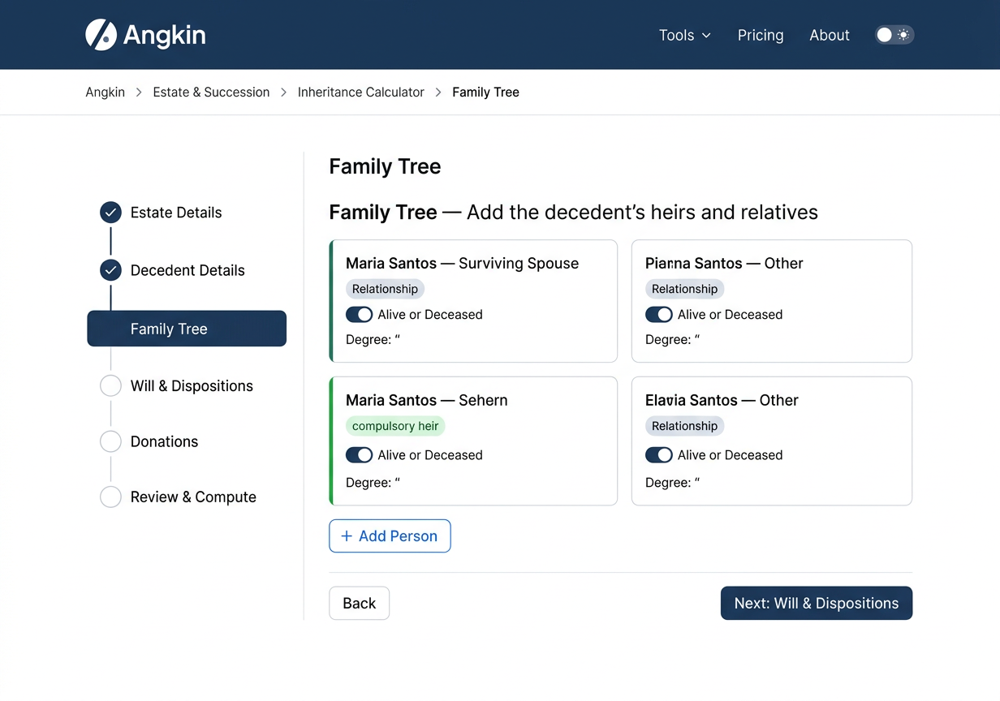
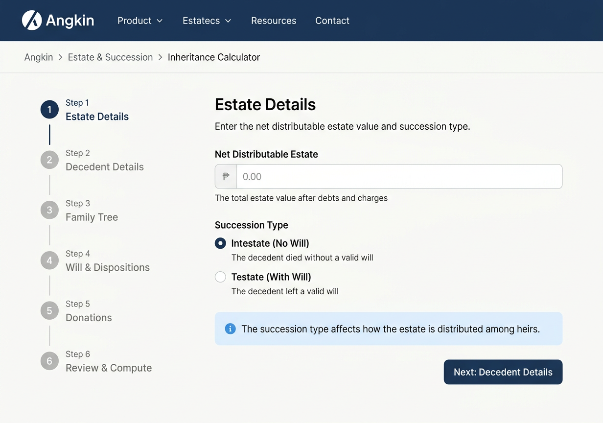

# 4.4 — Inheritance Wizard Step (Desktop 1280px)

## Screen Purpose

The Inheritance Calculator is Angkin's most complex tool — a 6-step wizard that captures estate details, decedent information, a full family tree with relationship types and filiation proofs, testamentary dispositions, donations, and finally computes estate distribution under the Philippine Civil Code.

The wizard must handle **legal complexity without overwhelming the user**. Most users are non-lawyers (executors, surviving spouses, heirs) trying to understand their inheritance rights. The design must guide them through dense legal concepts while keeping the interface approachable.

## Wizard Flow (6 Steps)

| Step | Name | Purpose |
|------|------|---------|
| 1 | Estate Details | Net distributable estate amount, intestate vs testate |
| 2 | Decedent Details | Name, date of death, marital status, legitimacy, marriage conditions |
| 3 | Family Tree | Add persons with relationships, degree, filiation proof, alive/deceased |
| 4 | Will & Dispositions | Institutions, legacies, devises, disinheritances (conditional on testate) |
| 5 | Donations | Inter vivos donations with collation rules |
| 6 | Review & Compute | Summary, scenario prediction, warnings, advanced settings |

Step 4 is conditional — only appears if succession type is "Testate" in Step 1.

## Page Structure — Wizard Layout

```
┌─────────────────────────────────────────────────────────────┐
│  Top Nav (64px) — Angkin logo, nav links, theme toggle       │
│  Breadcrumb: Angkin › Estate & Succession › Inheritance      │
├─────────┬───────────────────────────────────────────────────┤
│         │                                                    │
│  Wizard │  Step Content Area                                 │
│  Steps  │                                                    │
│         │  Step Heading + Description                        │
│  [✓] 1  │                                                    │
│  [✓] 2  │  Form Fields / Content                             │
│  [●] 3  │                                                    │
│  [ ] 4  │                                                    │
│  [ ] 5  │                                                    │
│  [ ] 6  │                                                    │
│         │                                                    │
│         │  ┌──────────────────────────────────────────────┐  │
│         │  │  ← Back          Next: [Step Name] →        │  │
│         │  └──────────────────────────────────────────────┘  │
├─────────┴───────────────────────────────────────────────────┤
│  Footer — Angkin logo, links, copyright                      │
└─────────────────────────────────────────────────────────────┘
```

## Layout Design Decisions

### Sidebar Wizard Stepper (Left, 240px)

The vertical stepper is the wizard's navigation spine. It shows progress and allows jumping back (but not forward past incomplete steps).

- **240px fixed width**, white background, right border 1px neutral-200
- Step items vertically stacked with 8px gap
- **Step states**:
  - **Completed**: Green checkmark icon, navy-600 text, clickable
  - **Active**: Navy-500 filled circle indicator, navy-700 semibold text, light navy-50 background
  - **Upcoming**: Gray-300 hollow circle, gray-400 text, not clickable
  - **Conditional (hidden)**: Step 4 hidden entirely when intestate
- Step number + name: Plus Jakarta Sans, 14px
- Active step has left 3px navy-500 border accent

```css
.wizard-stepper {
  width: 240px;
  padding: var(--space-6) var(--space-4);
  border-right: 1px solid var(--neutral-200);
  background: white;
  position: sticky;
  top: 64px; /* below nav */
  height: calc(100vh - 64px);
}

.wizard-step {
  display: flex;
  align-items: center;
  gap: var(--space-3);
  padding: var(--space-3) var(--space-4);
  border-radius: var(--radius-md);
  cursor: default;
  font-family: var(--font-heading);
  font-size: 14px;
  color: var(--neutral-400);
  transition: background 150ms ease;
}

.wizard-step--completed {
  color: var(--navy-600);
  cursor: pointer;
}

.wizard-step--completed:hover {
  background: var(--neutral-50);
}

.wizard-step--active {
  color: var(--navy-700);
  font-weight: var(--weight-semibold);
  background: var(--navy-50);
  border-left: 3px solid var(--navy-500);
}
```

### Content Area (Right, Fluid)

The main content area takes remaining width (max ~960px within content-default). Each step renders its own content here.

- **Step heading**: Plus Jakarta Sans, 24px, semibold, navy-700
- **Step description**: 15px, regular, neutral-500, max-width 640px
- **Form fields**: Full-width within content area, stacked vertically with 20px gap
- **Navigation buttons**: sticky bottom bar within content area
  - Left: "← Back" ghost button (hidden on step 1)
  - Right: "Next: [Step Name]" primary navy button

## Step 1: Estate Details

The simplest step — two fields. Sets the foundation for the entire calculation.

### Net Distributable Estate (Money Input)

- **Large money input** with ₱ prefix badge (navy-100 background, navy-600 text)
- Input uses IBM Plex Mono, 20px — larger than normal inputs because this is THE number
- Helper text below: "The total estate value after debts, charges, and funeral expenses"
- Validation: must be > 0

### Succession Type (Radio Group)

- Two radio options with descriptions (not just labels):
  - **Intestate (No Will)** — "The decedent died without a valid will. Estate distributed per Civil Code rules."
  - **Testate (With Will)** — "The decedent left a valid will. Dispositions apply subject to legitime."
- Radio cards: bordered cards with radio dot, navy selection ring, navy-50 background when selected
- Selection determines whether Step 4 (Will & Dispositions) appears in the stepper

### Info Callout

- Light blue (info-50) background card with info icon
- "The succession type determines how the estate is distributed. You can change this later."

## Step 3: Family Tree (Primary Mockup)

The most complex step — a dynamic list of person cards with 17+ fields each.

### Person Cards (2-Column Grid)

```
┌────────────────────────────────────────────────────────────┐
│  Family Tree — Add the decedent's heirs and relatives       │
│  Add all persons who may have inheritance rights.           │
│                                                             │
│  ┌─────────────────────┐  ┌─────────────────────┐         │
│  │ ● Maria Santos      │  │   Juan Santos Jr.   │         │
│  │   Surviving Spouse   │  │   Legitimate Child   │         │
│  │   Alive · Degree 1  │  │   Alive · Degree 1  │         │
│  │   [Compulsory Heir]  │  │   [Compulsory Heir]  │         │
│  │          [Edit] [×]  │  │          [Edit] [×]  │         │
│  └─────────────────────┘  └─────────────────────┘         │
│                                                             │
│  ┌─────────────────────┐                                   │
│  │   Ana Santos         │                                   │
│  │   Illegitimate Child │                                   │
│  │   Alive · Degree 1  │                                   │
│  │   [Compulsory Heir]  │                                   │
│  │          [Edit] [×]  │                                   │
│  └─────────────────────┘                                   │
│                                                             │
│  [+ Add Person]                                            │
│                                                             │
│  ┌──────────────────────────────────────────────────────┐  │
│  │  ← Back to Decedent Details                           │  │
│  │                    Next: Will & Dispositions →        │  │
│  └──────────────────────────────────────────────────────┘  │
└────────────────────────────────────────────────────────────┘
```

### Person Card Design

Each person is a white card with:

- **Name**: Plus Jakarta Sans, 16px, semibold, navy-700
- **Relationship badge**: Pill badge (navy-100 bg, navy-600 text), 12px
- **Status line**: "Alive · Degree 1" or "Predeceased · Degree 2" — 13px, neutral-500
- **Compulsory heir indicator**: Green badge if heir type is compulsory (spouse, legitimate children, legitimate ascendants)
- **Left border accent**:
  - Green (success-500) for compulsory heirs
  - Navy-300 for other heirs
  - Neutral-200 for non-heir relatives (e.g., collaterals who may be excluded)
- **Actions**: Edit (ghost button) and Remove (× icon, ghost danger)
- **Hover**: Subtle shadow elevation, card lifts 1px

```css
.person-card {
  background: white;
  border: 1px solid var(--neutral-200);
  border-left: 3px solid var(--neutral-200);
  border-radius: var(--radius-lg);
  padding: var(--space-4) var(--space-5);
  transition: box-shadow 150ms ease, transform 150ms ease;
}

.person-card:hover {
  box-shadow: var(--shadow-md);
  transform: translateY(-1px);
}

.person-card--compulsory {
  border-left-color: var(--success-500);
}

.person-card--other {
  border-left-color: var(--navy-300);
}

.person-cards-grid {
  display: grid;
  grid-template-columns: repeat(2, 1fr);
  gap: var(--space-4);
}
```

### Relationship Types Supported

The 11 relationship types from the engine, grouped for the dropdown:

- **Compulsory heirs**: Surviving Spouse, Legitimate Child, Legitimate Parent, Legitimate Ascendant
- **Other heirs**: Legitimated Child, Adopted Child, Illegitimate Child
- **Potential heirs**: Sibling, Nephew/Niece, Other Collateral
- **Non-heir**: Stranger (for testamentary dispositions only)

### Person Edit Panel (Slide-Out)

When "Edit" is clicked, a 480px right-side panel slides in with the full form:

- **Panel header**: "Edit Person — [Name]", navy-700, with × close button
- **Form sections**:
  1. **Basic**: Name (text), Relationship (dropdown), Alive at Succession (toggle)
  2. **Inheritance**: Degree (number, 1-5), Line (Paternal/Maternal, conditional), Blood Type (Full/Half, conditional)
  3. **Filiation**: Proof Type (dropdown), expandable
  4. **Adoption**: Regime, rescission status — collapsed accordion, only for adopted children
  5. **Unworthiness**: Is Unworthy toggle, Condoned toggle — collapsed accordion
  6. **Renunciation**: Has Renounced toggle — collapsed accordion
- **Conditional visibility**: Fields appear/hide based on relationship type. E.g., Blood Type only for siblings, Line only for ascendants beyond degree 1, Adoption only for adopted children.
- **Panel footer**: "Remove Person" danger button (left), "Save Changes" primary button (right)
- **Backdrop**: Semi-transparent black overlay on the wizard content

```css
.person-edit-panel {
  position: fixed;
  right: 0;
  top: 0;
  width: 480px;
  height: 100vh;
  background: white;
  box-shadow: var(--shadow-xl);
  z-index: 50;
  overflow-y: auto;
  padding: var(--space-6);
  animation: slideInRight 200ms ease;
}

@keyframes slideInRight {
  from { transform: translateX(100%); }
  to { transform: translateX(0); }
}

.person-edit-panel__backdrop {
  position: fixed;
  inset: 0;
  background: rgba(0, 0, 0, 0.3);
  z-index: 49;
}
```

## Generated Mockups

### 1. Family Tree Step — Person Cards Grid


Shows the wizard layout at Step 3: Family Tree. Left sidebar with vertical stepper (Steps 1-2 completed with checkmarks, Step 3 active with navy highlight). Main content area shows person cards in a 2-column grid — each card displaying name, relationship, alive/deceased status, and degree. Green left borders on compulsory heirs. "Add Person" button below the grid. Navigation buttons at bottom.

### 2. Person Edit Slide-Out Panel


Shows the slide-out panel for editing a person's details. 480px right panel with full form: name, relationship dropdown, alive toggle, degree, filiation proof type, blood type radio, with collapsed accordion sections for adoption and unworthiness. "Remove Person" danger button and "Save Changes" primary button at bottom.

### 3. Estate Details Step (Step 1)


Shows the wizard at Step 1: Estate Details. The simplest step with a large peso money input for net distributable estate and radio card selection for succession type (Intestate vs Testate). Info callout card at bottom explaining the succession type impact. Only "Next" button visible (no back on step 1).

## Key Design Patterns

### Wizard Navigation Anti-Patterns Avoided

1. **No horizontal stepper** — With 6 steps (conditionally 5), a horizontal stepper wastes vertical space. The sidebar stepper is always visible and scannable.
2. **No "Save Draft" confusion** — The wizard auto-persists state. No explicit save button. Users can navigate away and return.
3. **No step numbers in the active view** — The heading says "Family Tree", not "Step 3: Family Tree". The sidebar provides the number context.
4. **No forward-skipping** — Cannot click on Step 5 from Step 3. Must complete in order.

### Complex Form Management

The Family Tree step uses React Hook Form's `useFieldArray` for the dynamic person list. Key UX decisions:

- **Card grid, not a table** — Person data is too heterogeneous for tabular display. Cards allow visual grouping.
- **Edit in panel, not inline** — With 17+ fields per person, inline editing would make the cards enormous. The slide-out panel gives full space.
- **Relationship-driven conditional fields** — The panel shows/hides fields based on relationship type, reducing cognitive load.
- **Compulsory heir highlighting** — Green left border is the only visual distinction. No banner, no modal — just a consistent color signal.

### Information Architecture

The wizard follows **progressive complexity**:

1. **Estate Details** — 2 fields. "What's the estate worth?"
2. **Decedent Details** — 5-8 fields. "Who died and what was their situation?"
3. **Family Tree** — N persons × 17 fields each. "Who inherits?"
4. **Will & Dispositions** — 4 tabbed sections. "What did the will say?"
5. **Donations** — N donations × 12 fields. "What was given away before death?"
6. **Review** — Read-only summary. "Is everything correct?"

Steps 1-2 are fast. Step 3 is where most time is spent. Steps 4-5 are conditional/optional for many cases. Step 6 is the payoff.

## CSS Variables for Wizard

```css
/* Wizard layout */
.wizard-layout {
  display: grid;
  grid-template-columns: 240px 1fr;
  min-height: calc(100vh - 64px);
}

/* Step content */
.step-content {
  max-width: var(--content-default); /* 960px */
  padding: var(--space-8) var(--space-10);
}

.step-heading {
  font-family: var(--font-heading);
  font-size: 24px;
  font-weight: var(--weight-semibold);
  color: var(--navy-700);
  margin-bottom: var(--space-2);
}

.step-description {
  font-family: var(--font-body);
  font-size: 15px;
  color: var(--neutral-500);
  max-width: 640px;
  margin-bottom: var(--space-8);
  line-height: var(--leading-relaxed);
}

/* Wizard navigation */
.wizard-nav {
  display: flex;
  justify-content: space-between;
  align-items: center;
  padding-top: var(--space-8);
  border-top: 1px solid var(--neutral-100);
  margin-top: var(--space-8);
}
```

## Relationship to Platform

- **Same nav** as all Angkin pages (from 4.1)
- **Breadcrumb**: Angkin › Estate & Succession › Inheritance Calculator
- **Same footer** as platform home
- **Tool branding**: "Inheritance Calculator" with the scales icon from sub-tool branding (2.5)
- **"by Angkin" badge** visible in the sidebar stepper header

## Notes

- Logo reference image not available in CI — mockups generated without `-r` flag. AI approximated the logo mark.
- The wizard stepper collapses to a horizontal progress bar on mobile (375px) — covered in aspect 4.6.
- Step 4 (Will & Dispositions) uses a tabbed interface within the step — Institutions, Legacies, Devises, Disinheritances — but is not shown in these mockups as it's a conditional step.
- The Review step (Step 6) includes scenario prediction and warnings — a computation preview before the user commits.

---

*Inheritance wizard mockups complete. Three views: Family Tree step with person cards grid, person edit slide-out panel, and Estate Details opening step. The sidebar stepper + panel edit pattern handles the wizard's complexity without overwhelming the user. Every person card signals compulsory heir status with green left border. Progressive complexity from 2 fields (Step 1) to N×17 fields (Step 3).*
