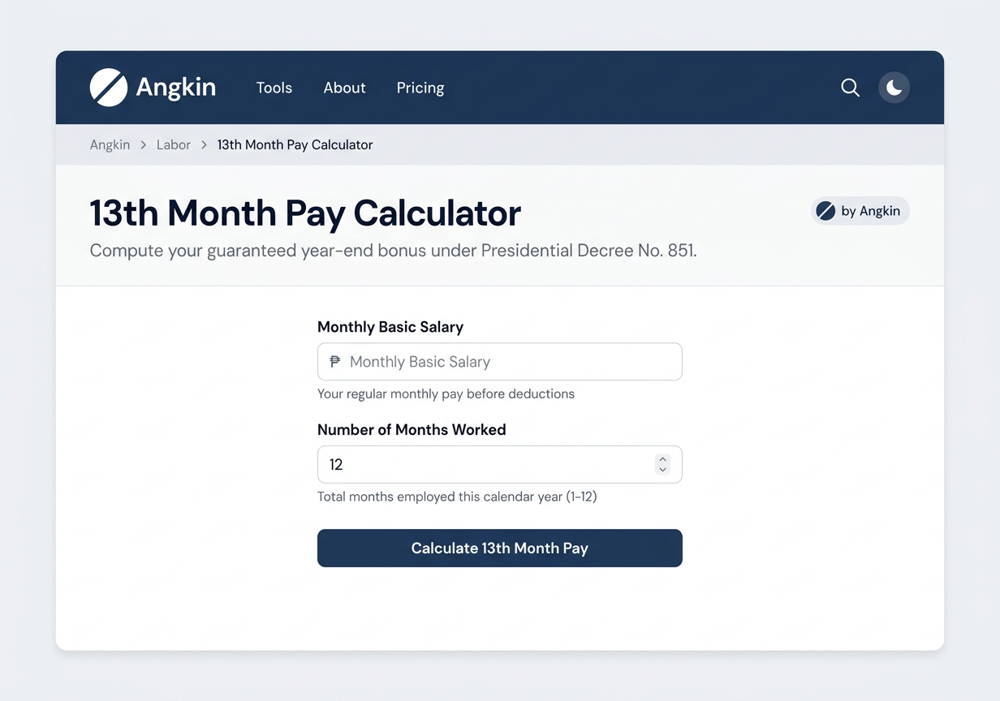
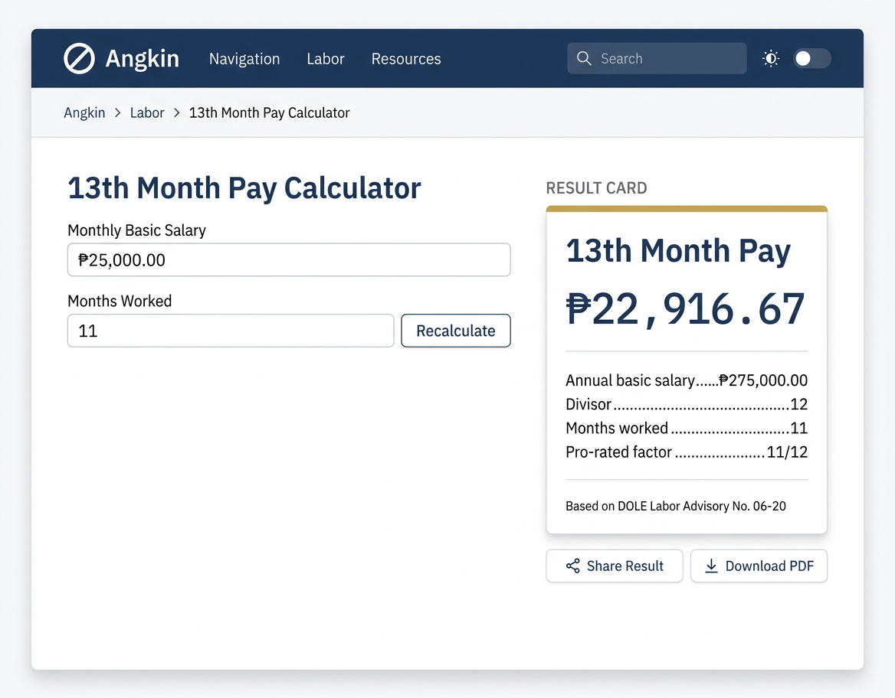
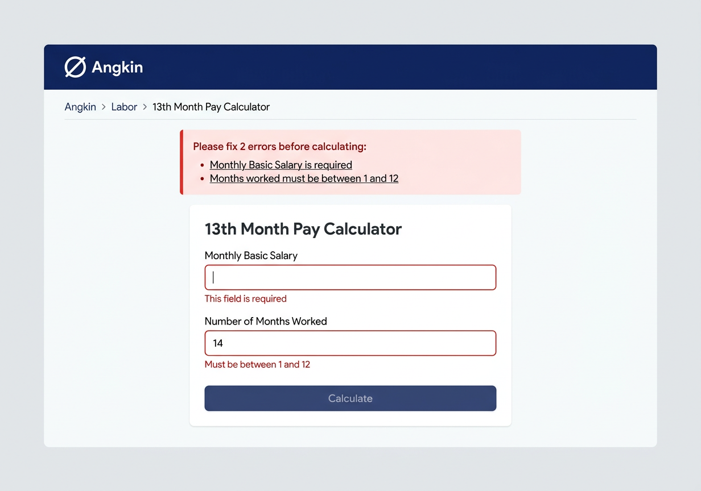

# 4.5 — Generic "New Tool" Template (Desktop 1280px)

## Screen Purpose

This is the **day-1 template** — what every new compliance calculator looks like when it launches on Angkin. With 146 unnamed tools (everything except TaxKlaro and Inheritance), this template defines the default experience. It must:

1. Feel immediately familiar to users who've used any other Angkin tool
2. Work for the most common archetype: **single-form calculators** (43% of 148 tools)
3. Scale up to multi-field forms without breaking
4. Deliver the result moment with the same authority as flagship tools
5. Require zero custom design work — a developer copies the template and fills in fields

The example tool: **13th Month Pay Calculator** (Labor category, single-form calculator archetype).

---

## Page Structure

### Empty/Input State

```
┌──────────────────────────────────────────────────────────────┐
│  Nav Bar (64px) — [⌀] Angkin  |  Tools  About  Pricing  🔍 🌙│
├──────────────────────────────────────────────────────────────┤
│  Angkin  ›  Labor  ›  13th Month Pay Calculator              │
├──────────────────────────────────────────────────────────────┤
│                                                               │
│           13th Month Pay Calculator                           │  ← 28px bold navy
│           Compute your guaranteed year-end bonus              │  ← 16px neutral-500
│           under Presidential Decree No. 851.                  │
│                                                    [by Angkin]│
│                                                               │
│  ┌─── Form Area (576px max-width, centered) ───────────────┐ │
│  │                                                          │ │
│  │  Monthly Basic Salary                                    │ │
│  │  ┌──┬───────────────────────────────────────┐            │ │
│  │  │₱ │ Enter amount                          │            │ │
│  │  └──┴───────────────────────────────────────┘            │ │
│  │  Your regular monthly pay before deductions              │ │
│  │                                                          │ │
│  │  Number of Months Worked                                 │ │
│  │  ┌──────────────────────────────────────────┐            │ │
│  │  │ 12                                       │            │ │
│  │  └──────────────────────────────────────────┘            │ │
│  │  Total months employed this calendar year (1-12)         │ │
│  │                                                          │ │
│  │  ┌──────────────────────────────────────────┐            │ │
│  │  │      Calculate 13th Month Pay            │ ← primary  │ │
│  │  └──────────────────────────────────────────┘            │ │
│  │                                                          │ │
│  └──────────────────────────────────────────────────────────┘ │
│                                                               │
└──────────────────────────────────────────────────────────────┘
```

### Results State

```
┌──────────────────────────────────────────────────────────────┐
│  Nav + Breadcrumb (same as above)                             │
├──────────────────────────────────────────────────────────────┤
│                                                               │
│   ┌── Form (left, ~55%) ───┐  ┌── Result Card (right) ────┐ │
│   │                        │  │ ▬▬▬▬▬▬▬▬▬▬▬▬▬ (navy bar) │ │
│   │  Monthly Basic Salary  │  │                            │ │
│   │  [₱ 25,000.00       ]  │  │  13th Month Pay            │ │
│   │                        │  │                            │ │
│   │  Months Worked         │  │     ₱22,916.67             │ │
│   │  [11                 ]  │  │                            │ │
│   │                        │  │  Annual salary...₱275,000  │ │
│   │  [  Recalculate  ]     │  │  Divisor...............12  │ │
│   │                        │  │  Months worked........11   │ │
│   │                        │  │  Pro-rated.........11/12   │ │
│   │                        │  │                            │ │
│   │                        │  │  ── DOLE LA No. 06-20 ──  │ │
│   │                        │  │                            │ │
│   │                        │  │  [Share]  [Download PDF]   │ │
│   │                        │  └────────────────────────────┘ │
│   └────────────────────────┘                                  │
│                                                               │
└──────────────────────────────────────────────────────────────┘
```

### Validation Error State

```
┌──────────────────────────────────────────────────────────────┐
│  Nav + Breadcrumb                                             │
├──────────────────────────────────────────────────────────────┤
│                                                               │
│  ┌─── Error Summary Banner ─────────────────────────────────┐│
│  │ ▐ Please fix 2 errors before calculating:                ││
│  │   • Monthly Basic Salary is required                     ││
│  │   • Months worked must be between 1 and 12               ││
│  └──────────────────────────────────────────────────────────┘│
│                                                               │
│  ┌─── Form Area (576px) ───────────────────────────────────┐ │
│  │                                                          │ │
│  │  Monthly Basic Salary                                    │ │
│  │  ┌──┬───────────────────────────── ERROR BORDER ┐        │ │
│  │  │₱ │                                           │        │ │
│  │  └──┴───────────────────────────────────────────┘        │ │
│  │  This field is required  ← red, replaces help text       │ │
│  │                                                          │ │
│  │  Number of Months Worked                                 │ │
│  │  ┌────────────────────────────── ERROR BORDER ──┐        │ │
│  │  │ 14                                           │        │ │
│  │  └──────────────────────────────────────────────┘        │ │
│  │  Must be between 1 and 12  ← red, replaces help text    │ │
│  │                                                          │ │
│  └──────────────────────────────────────────────────────────┘ │
└──────────────────────────────────────────────────────────────┘
```

---

## Design Decisions for the Template

### 1. Single Layout, Two Modes

- **Input state**: Single-column, centered at `--content-narrow` (576px). The form is the only thing on screen. No distractions.
- **Results state**: Expands to two-column at `--content-default` (960px). Form slides left, result card appears right. The result card is the reward — it deserves its own column.
- **Transition**: When the user clicks "Calculate", the layout smoothly expands (250ms ease-out) and the result card fades in from the right (200ms delay).

This two-mode approach ensures the input form feels focused and the result feels like a distinct, authoritative moment.

### 2. Tool Header Pattern

Every generic tool gets the same header:

```css
.tool-header {
  max-width: var(--content-default); /* 960px */
  margin: 0 auto;
  padding: var(--space-8) var(--container-padding-desktop) var(--space-6);
}

.tool-header__title {
  font-family: var(--font-heading);
  font-size: var(--tool-title-size); /* 28px */
  font-weight: var(--tool-title-weight); /* 700 */
  color: var(--navy-600);
  margin: 0 0 var(--space-2);
}

.tool-header__subtitle {
  font-family: var(--font-body);
  font-size: var(--tool-subtitle-size); /* 16px */
  color: var(--neutral-500);
  line-height: 1.5;
  max-width: 600px;
}
```

- Title in Plus Jakarta Sans bold, 28px, navy-600
- Subtitle in DM Sans regular, 16px, neutral-500 — one sentence describing what this tool computes
- "by Angkin" badge in the top-right corner of the header area (per 2.5 spec)
- No tool-specific icon in the header — icons are for the card grid only

### 3. Form Area

- Centered at `--content-narrow` (576px) for single-column calculator forms
- Uses the standard form input specs from 3.2:
  - 40px height inputs
  - Peso prefix for money inputs (₱ in IBM Plex Mono)
  - Semibold labels (14px DM Sans weight-500)
  - Help text below in 13px neutral-400
  - 16px field gap, 24px group gap
- Calculate button: full-width primary, navy-600, 48px height (large)

### 4. Result Card

The result card is the most important element — it uses the result-card spec from 3.3:

```css
.result-card {
  background: var(--neutral-0);
  border: 1px solid var(--neutral-200);
  border-radius: var(--radius-xl); /* 14px */
  box-shadow: var(--shadow-md);
  overflow: hidden;
}

.result-card__accent {
  height: 3px;
  background: var(--navy-600);
}

.result-card__amount {
  font-family: var(--font-mono);
  font-size: var(--peso-display-lg); /* 32px */
  font-weight: 600;
  color: var(--peso-amount); /* navy-600 */
  font-variant-numeric: tabular-nums;
}
```

- 3px navy top accent bar
- Tool name as card heading
- Large peso amount: IBM Plex Mono, 32px, navy-600
- Breakdown section with dotted leaders (from 3.5 comparison table pattern)
- Legal reference note at bottom (e.g., "Based on DOLE Labor Advisory No. 06-20")
- Share and Download PDF ghost buttons below

### 5. Error Handling

Following the wizard validation pattern from 3.7:

- **5+ errors**: Summary banner at top (error-50 bg, 3px left error border, clickable items that scroll to field)
- **Per-field errors**: Red border (error-500), red error text (error-600) that **replaces** the help text (doesn't stack)
- **Button state**: Button remains enabled but form scrolls to first error on submit
- **Error summary format**:

```css
.error-summary {
  background: var(--error-50);
  border-left: 3px solid var(--error-500);
  border-radius: var(--radius-md);
  padding: var(--space-4);
  margin-bottom: var(--space-6);
}

.error-summary__title {
  font-family: var(--font-body);
  font-size: 14px;
  font-weight: 500;
  color: var(--error-700);
  margin-bottom: var(--space-2);
}

.error-summary__item {
  font-family: var(--font-body);
  font-size: 13px;
  color: var(--error-600);
  cursor: pointer;
  padding: var(--space-1) 0;
}

.error-summary__item:hover {
  text-decoration: underline;
}
```

### 6. What This Template Does NOT Include

Things that are NOT part of the generic template (reserved for flagship tools):

- **No sidebar navigation** — single-form calculators don't need it
- **No wizard stepper** — that's the wizard pattern (3.7), used when tools need it
- **No tool-specific accent color** — uses standard navy + gold palette
- **No custom illustrations** — the data and result are the visual focus
- **No comparison columns** — that's the comparison engine archetype
- **No save/bookmark** — future feature, not day-1

---

## Template File Structure

A new tool developer copies this structure:

```
apps/[tool-slug]/
├── frontend/
│   ├── src/
│   │   ├── components/
│   │   │   ├── ToolForm.tsx        ← Input fields (from template)
│   │   │   ├── ResultCard.tsx      ← Result display (from template)
│   │   │   └── ErrorSummary.tsx    ← Validation errors (from template)
│   │   ├── hooks/
│   │   │   └── useCalculation.ts   ← WASM binding (custom per tool)
│   │   ├── App.tsx                 ← Layout shell (from template)
│   │   └── index.css               ← Angkin design tokens (shared)
│   └── index.html
├── engine/                          ← Rust WASM engine (custom per tool)
└── README.md
```

The template provides `ToolForm`, `ResultCard`, `ErrorSummary`, and `App` as copy-paste starting points. The developer only writes the engine logic and field definitions.

---

## Generated Mockups

### 1. Empty/Input State


Full page view of the 13th Month Pay Calculator in its initial state: nav bar, breadcrumb trail (Angkin › Labor › 13th Month Pay Calculator), tool header with title and subtitle, centered form with two fields (Monthly Basic Salary with ₱ prefix, Number of Months Worked), and full-width "Calculate" primary button.

### 2. Results State


After computation: two-column layout with the filled form on the left and the result card on the right. Result card shows 3px navy top accent, "13th Month Pay" heading, large ₱22,916.67 in monospace, breakdown with dotted leaders (annual salary, divisor, months worked, pro-rated factor), legal reference note, and Share/Download ghost buttons.

### 3. Validation Error State


Error handling: red error summary banner at top with 3px left border listing 2 errors (salary required, months out of range), individual field red borders with error messages replacing help text. Demonstrates the validation pattern that every tool inherits from the template.

---

## Template Sizing Across Archetypes

While this mockup shows a single-form calculator, the template adapts to other archetypes:

| Archetype | Form Width | Result Treatment | Layout Change |
|-----------|-----------|-----------------|--------------|
| **Single-form calculator** | 576px narrow | Single result card | Two-column on result |
| **Decision tree / Eligibility** | 576px narrow | Verdict card (yes/no + explanation) | Two-column on result |
| **Comparison engine** | 576px narrow → 960px results | Multiple result cards side-by-side | Full-width results below form |
| **Multi-step wizard** | 576px narrow per step | Result card after final step | Add wizard stepper (3.7) |
| **Lookup table** | 576px narrow (search input) | Table below | Single column throughout |
| **Document generator** | 576px narrow | Checklist card + download | Two-column on result |

The form inputs, result card, error handling, nav bar, breadcrumb, and tool header are **identical** across all archetypes. The only differences are layout geometry and result presentation.

---

## Key CSS for This Screen

```css
/* === Tool Page Shell === */
.tool-page {
  min-height: 100vh;
  background: var(--neutral-0);
}

/* === Input State: Centered Narrow Form === */
.tool-form-centered {
  max-width: var(--content-narrow); /* 576px */
  margin: 0 auto;
  padding: var(--space-8) var(--container-padding-desktop);
}

/* === Results State: Two-Column === */
.tool-results-layout {
  max-width: var(--content-default); /* 960px */
  margin: 0 auto;
  padding: var(--space-8) var(--container-padding-desktop);
  display: grid;
  grid-template-columns: 1fr 380px;
  gap: var(--space-8); /* 32px */
  align-items: start;
}

/* Result card is sticky so it stays visible while scrolling long forms */
.tool-results-layout .result-card-container {
  position: sticky;
  top: calc(64px + var(--space-4)); /* nav height + breathing room */
}

/* === Transition from input to results === */
.tool-form-centered {
  transition: max-width 250ms ease-out;
}

.tool-form-centered[data-has-results] {
  max-width: var(--content-default);
}

/* === Calculate Button (Full Width Primary) === */
.tool-calculate-btn {
  width: 100%;
  height: var(--button-lg); /* 48px */
  font-family: var(--font-heading);
  font-size: 15px;
  font-weight: 600;
  background: var(--navy-600);
  color: white;
  border: none;
  border-radius: var(--radius-md);
  cursor: pointer;
  transition: background 150ms ease, transform 50ms ease;
  box-shadow: var(--shadow-xs);
}

.tool-calculate-btn:hover {
  background: var(--navy-700);
}

.tool-calculate-btn:active {
  background: var(--navy-800);
  transform: translateY(1px);
  box-shadow: none;
}

/* === Result Actions (below card) === */
.result-actions {
  display: flex;
  gap: var(--space-3);
  margin-top: var(--space-4);
}

.result-actions button {
  font-family: var(--font-body);
  font-size: 13px;
  font-weight: 500;
  color: var(--neutral-500);
  background: transparent;
  border: 1px solid var(--neutral-200);
  border-radius: var(--radius-md);
  padding: var(--space-2) var(--space-4);
  cursor: pointer;
  transition: color 150ms, border-color 150ms;
}

.result-actions button:hover {
  color: var(--navy-600);
  border-color: var(--navy-300);
}

/* === Legal Reference Note === */
.result-legal-note {
  font-family: var(--font-body);
  font-size: 12px;
  color: var(--neutral-400);
  border-top: 1px solid var(--neutral-200);
  padding-top: var(--space-3);
  margin-top: var(--space-4);
}
```

---

## Notes

- Logo reference image (`docs/brand/angkin/direction-02c-radical-clarity.png`) was not available in this environment. Mockups use AI-approximated mark (circle + diagonal slash), consistent with previous Wave 4 mockups.
- The template is designed for React 19 + Tailwind 4 + Rust WASM (matching existing TaxKlaro/Inheritance stack), but the design tokens and CSS are framework-agnostic.
- The two-column results layout is the **primary differentiator** from a typical SaaS form. Most calculators dump results below the form — Angkin places them alongside, which lets users adjust inputs and see results update without scrolling.

---

*Generic new tool template complete. Three states documented: empty input, results, and validation errors. The template defines the default experience for 146 unnamed tools and adapts across all 8 archetypes through layout geometry changes only — components remain identical.*
